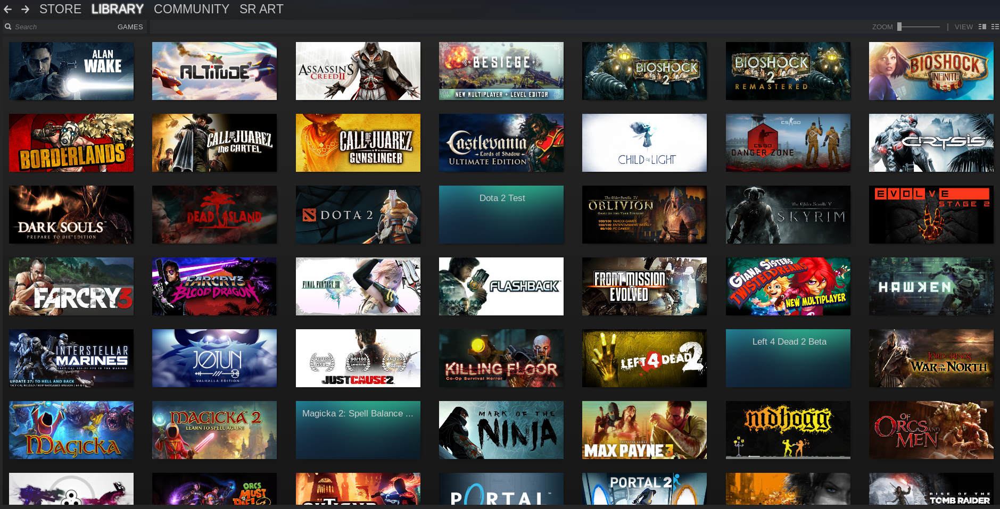

# Deep AutoEncoders for Collaborative Filtering

Collaborative Filtering is a method used by recommender systems to make predictions about an interest of an specific user by collecting taste or preferences information from many other users. The technique of Collaborative Filtering has the underlying assumption that if a user A has the same taste or opinion on an issue as the person B, A is more likely to have B’s opinion on a different issue. 

**This project implements different Deep Autoencoder for Collaborative Filtering for Recommendation Systems in Keras** based on different articles. The test case uses the Steam Platform interactions dataset to recommend games for users



This Project:

* Implemented Recommender Models
  * Popularity Model
  * CDAE - Collaborative Denoising Auto-Encoders for Top-N Recommender Systems
  * Deep AutoEncoder for Collaborative Filtering
  * Deep AutoEncoder for Collaborative Filtering With Content Information
* Requirements
* Getting Started
  * Dataset
  * Model Training
  * Recommender
* Rerefences

## Implemented Recommender Models

**This is an adapted implementation of the original article, simplifying some features for a better understanding of the models.**

#### 1. Popularity Model

This model makes recommendations using the most popular games, the ones that had the most purchases in a period. This recommendation is not personalized, that is, it is the same for all users

This is a Base Model that will be used to compare with AutoEncoders Models. 

```
./popularity_train.py
```

#### 2. CDAE - Collaborative Denoising Auto-Encoders for Top-N Recommender Systems

```
Yao Wu, Christopher DuBois, Alice X. Zheng, Martin Ester. 
Collaborative Denoising Auto-Encoders for Top-N Recommender Systems.
The 9th ACM International Conference on Web Search and Data Mining (WSDM'16), p153--162, 2016.  
```

[Steam](docs/model_summary_1.png)

```
./model/CDAEModel.py
```

#### 3. Deep AutoEncoder for Collaborative Filtering

```
KUCHAIEV, Oleksii; GINSBURG, Boris. 
Training deep autoencoders for collaborative filtering. 
arXiv preprint arXiv:1708.01715, 2017. 
https://github.com/NVIDIA/DeepRecommender
https://arxiv.org/pdf/1708.01715.pdf
```

[Steam](docs/model_summary_2.png)

```
./model/AutoEncModel.py
```

#### 4. Deep AutoEncoder for Collaborative Filtering With Content Information

This model is an adaptation of the model presented previously, but adding content information. In this way the model is a Hybrid implementation.

In this model I add the 'game name' of all games that the user has already played as additional information for collaborative filtering. This is a way to add content information to the user level.

[Steam](docs/model_summary_3.png)

```
./model/AutoEncContentModel.py
```

## Requirements

Create a conda env from ```conda.yaml```

* python=3.6
* cloudpickle=0.6.1
* numpy=1.14.3
* pandas=0.22.0
* scikit-learn=0.19.1
* seaborn=0.9
* click=6.7
* keras=2.1.5
* tensorflow==1.7.0  
* scipy=1.0.1
* graphviz
* pydotplus
* mlflow

## Getting Started

This project uses [MLflow](https://www.mlflow.org) for reproducibility, model training and dependency management. Install mlflow before:

```
$ pip install mlflow
```

### Dataset

The current version use a SteamVideGames Dataset obtained from https://www.kaggle.com/tamber/steam-video-games .

This dataset is a list of user behaviors, with columns:'user_id', 'game', 'type', 'hours', 'none'. The type included are 'purchase' and 'play'. The value indicates the degree to which the behavior was performed - in the case of 'purchase' the value is always 1, and in the case of 'play' the value represents the number of hours the user has played the game.

```
./data/raw/rating.csv
```

| user_id  | game | type | hours | none |
| -------- | ---------------- | ---------------- | ----------- |  ------------ |
| 151603712 | "The Elder Scrolls V Skyrim" | purchase | 1.0 | 0 |
| 151603712 | "The Elder Scrolls V Skyrim" | play | 273.0 | 0 |
| 151603712 | "Fallout 4" | purchase | 1.0 | 0 |
| ... | ... | ... | ... | ... |


### Model Training

#### Data Preparation

This step will transform the original data, group the interactions to implicity feedback and will create the datasets used in the training and testing of the models.

```
$ mlflow run . -e data_preparation -P min_interactions=5 -P test_size=0.2
```

This process will create different datasets:

* ./data/articles_df.csv
* ./data/interactions_full_df.csv
* ./data/interactions_train_df.csv (Subset of 'interactions_full_df.csv' for train.)
* ./data/interactions_test_df.csv (Subset of 'interactions_full_df.csv' for test.)

**articles_df.csv**

Contain the data exclusively of the items (games)

| content_id  | game | total_users | total_hours |
| -------- | ---------------- | ---------------- | ----------- | 
| 0 | 007 Legends | 1 | 1.7 |
| 1 | 0RBITALIS | 3 | 4.2 |

**interactions_full_df.csv**

Contain the data of interactions between user X item, amount of hours played (hours) and played (view) as implicit feedback.

| user_id | content_id | game | hours | view | 
| -------- | ---------------- | ---------------- | ----------- |  ----------- | 
| 134  | 1680 | Far Cry 3 Blood Dragon | 2.2 | 1 |
| 2219 | 1938 | Gone Home | 1.2 | 1 |
| 3315 | 3711 | Serious Sam 3 BFE | 3.7 | 1 |

#### Training

Popularity template training and auto decoders are in different scripts.

##### Train popularity model

```
$ mlflow run . -e popularity_train
```

##### Train Autoencoders

Parameter ```--name``` indicates the model to be trained. Depending on the model some parameters have no effect.

```
Usage: mlflow run . [OPTIONS]

  Autoencoder Matrix Fatorization Model

Options:
  --name [auto_enc|cdae|auto_enc_content]
  --factors INTEGER
  --layers TEXT
  --epochs INTEGER
  --batch INTEGER
  --activation [relu|elu|selu|sigmoid]
  --dropout FLOAT
  --lr FLOAT
  --reg FLOAT
  --help
```

Command to execute the training of the "Deep AutoEncoder for Collaborative Filtering":

```
$ mlflow run . 
        -P name=auto_enc 
        -P layers='[512,256,512]' 
        -P epochs=100
        -P batch=64 
        -P activation=selu 
        -P dropout=0.8 
        -P lr=0.0001 
        -P reg=0.01
```

After the trained model, the artifacts will be saved in `./mlruns/0/UID/`

If you want to run the training for all models run the script `$ ./train_all.sh`

#### Evaluation

### Recommender

## Rerefences